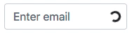

# @tkrotoff/bootstrap-input-spinner

[](https://www.npmjs.com/package/@tkrotoff/bootstrap-input-spinner)
[](https://github.com/tkrotoff/bootstrap-input-spinner/actions)
[](https://github.com/prettier/prettier)

Bootstrap >= 4.4 spinner/loading/pending indicator for `<input>`, `<textarea>` and `<select>`



Example: https://codesandbox.io/s/github/tkrotoff/bootstrap-input-spinner/tree/codesandbox.io

- Small: ~200 lines of [SCSS](src/bootstrap-input-spinner.scss)
- Works in latest browsers and IE >= 10
- Uses [Bootstrap variables](https://getbootstrap.com/docs/4.6/getting-started/theming/#variable-defaults)

Check the [changelog](CHANGELOG.md) for breaking changes and fixes between releases.

⚠️ Latest implementation for Bootstrap < 4.2 is [bootstrap-spinner v0.0.4](https://github.com/tkrotoff/bootstrap-input-spinner/tree/v0.0.4)

## Usage

`npm install @tkrotoff/bootstrap-input-spinner`

Import [bootstrap-input-spinner.scss](src/bootstrap-input-spinner.scss):

```SCSS
@import '~@tkrotoff/bootstrap-input-spinner/src/bootstrap-input-spinner';
```

Modify your [Bootstrap 4 code](https://getbootstrap.com/docs/4.6/components/forms/) as follow:

```HTML
<div class="form-group">
  <label for="email">Email address</label>
  <div class="is-loading">
    <input type="email" id="email" class="form-control">
    <div class="spinner-border spinner-border-sm"></div>
  </div>
</div>
```
