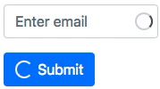

# bootstrap-spinner

Bootstrap 4 spinner for `<input>` and `<button>`



Example: https://codesandbox.io/s/github/tkrotoff/bootstrap-spinner

- Small: less than 100 lines of [SCSS](src/bootstrap4-spinner.scss)
- No SVG, image... just CSS
- Works in latest browsers and IE >= 10
- Uses [Bootstrap variables](https://getbootstrap.com/docs/4.1/getting-started/theming/#variable-defaults): nothing hardcoded

## Usage

Import [bootstrap4-spinner.scss](src/bootstrap4-spinner.scss) and then modify your [Bootstrap 4 code](https://getbootstrap.com/docs/4.1/components/forms/) as follow:

```HTML
<div class="form-group">
  <label for="email">Email address</label>
  <input type="email" id="email" class="form-control is-pending">
  <span class="spinner"></span>
</div>
```

```HTML
<button class="btn btn-primary btn-spinner">
  <span class="spinner"></span>
  Submit
</button>
```

You can change the spinner size by overwriting Sass variable `$spinner-size`:

```SCSS
import '~bootstrap-spinner/src/bootstrap4-spinner';

$spinner-size: 40px;
```
